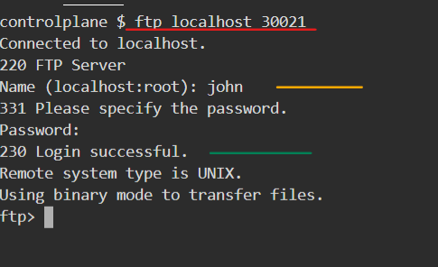

## Instruction to create Image

  ```bash
  docker build -t ftp-server .
  ```

-----------------------------

## Run Image and test it
  
  1. Run container in backgroup mode
  
     ```bash
     docker run -d -p 30020-30021:20-21 -p 40000-40009:40000-40009 --env FTP_USER=john --env FTP_PASS=123 --volume $(pwd):/home/john   --name ct ftp-server
     ```
  
  2. Install FTP on host or any machine
     
     ```bash
     apt update
     apt install ftp -y
     ```
  
  3. Login to ftp server  . Give the username and password when promted

     ```bash
     ftp localhost 30021
     ```
     
     

------------------------------------------

## K8s Run 

1. Push the Image to Dockerhub
   
   ```bash
   REPO_IMAGE_NAME=vegito/ftp-server
   docker login --username vegito
   docker tag ftp-server ${REPO_IMAGE_NAME}:latest
   docker push ${REPO_IMAGE_NAME}:latest
   ```

2. Replace the Image name in deployment and Install the resources.

    ```bash
    kubectl apply -f manifest/deployment.yaml
    kubectl apply -f manifest/service.yaml
    ```

3. Login to the fpt using nodeport
   
   