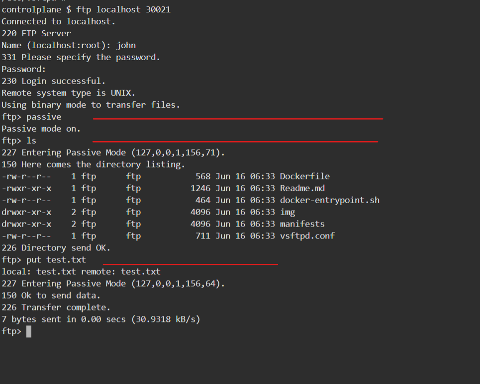
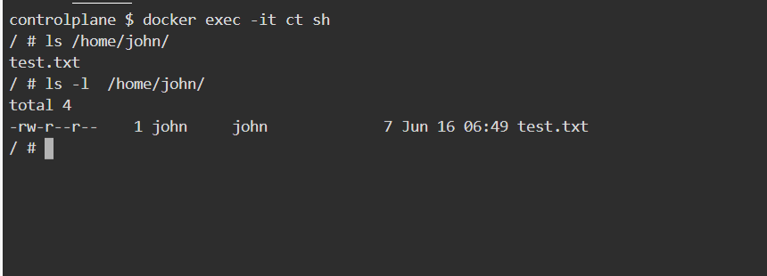

## Instruction to create Image

  ```bash
  docker build -t ftp-server .
  ```

-----------------------------

## Run Image and test it
  
  1. Run container in backgroup mode
  
     ```bash
     docker run -d --name ct --volume $(pwd):/home/john -p 30020-30021:20-21 -p 40000-40009:40000-40009 \
     --env FTP_USER=john --env FTP_PASS=123  --env EXTERNAL_IP=127.0.0.1 ftp-server

     docker run --rm -it ftp-server sh
     
     docker exec -it ct sh
     ```
  
  2. Install FTP on host or any machine
     
     ```bash
     apt update
     apt install ftp -y
     ```
  
  3. Login to ftp server  . Give the username and password when promted

     ```bash
     ftp localhost 30021
     ```
     
     
   
   4. Enter to Passive mode and trasfer file to ftp server
      
      ```bash
      ftp> passive
      
      ftp> ls

      ftp> put test.txt

      ```

      

      

------------------------------------------

## K8s Run 

1. Push the Image to Dockerhub
   
   ```bash
   REPO_IMAGE_NAME=vegito/ftp-server
   docker login --username vegito
   docker tag ftp-server ${REPO_IMAGE_NAME}:latest
   docker push ${REPO_IMAGE_NAME}:latest
   ```

2. Replace the Image name in deployment and Install the resources.

    ```bash
    kubectl apply -f manifest/deployment.yaml
    kubectl apply -f manifest/service.yaml

    kubectl exec -it deploy/ftp-deployment sh
    ```

3. Login to the fpt using nodeport
   
   

4. Testing from another container 
   
   ```bash
   kubectl run test --rm -it --image ubuntu 
   apt update && apt install ftp -y
   ```